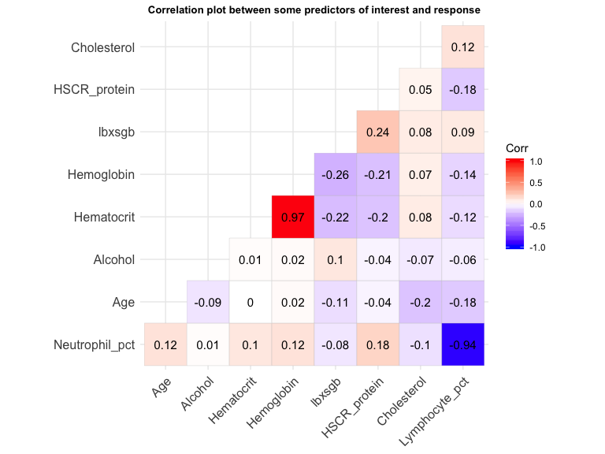

Analysis
================
Ngoc Duong
4/2/2020

### Data import and preparation

First, we import the created train and test datasets. Then, we can
identify response variable and design matrices for both datasets.

``` r
#import data and transform some variables into categorical 
chol_full = read_csv("./full_data.csv")  %>% 
  mutate(
    bpq020 = as.factor(bpq020),
    cdq001 = as.factor(cdq001),
    hsd010 = as.factor(hsd010),
    diq010 = as.factor(diq010),
    dbq700 = as.factor(dbq700),
    fsd032a = as.factor(fsd032a),
    fsd032c = as.factor(fsd032c),
    fsdhh = as.factor(fsdhh),
    hiq270 = as.factor(hiq270),
    paq605 = as.factor(paq605),
    smq020 = as.factor(smq020),
    dbd100 = as.factor(dbd100),
    drqsprep = as.factor(drqsprep),
    drqsdiet = as.factor(drqsdiet),
    dr1_300 = as.factor(dr1_300),
    drd340 = as.factor(drd340),
    drd360 = as.factor(drd360),
    riagendr = as.factor(riagendr),
    ridreth1 = as.factor(ridreth1),
    ridreth3 = as.factor(ridreth3),
    dmdborn4 = as.factor(dmdborn4)) %>% drop_na()
```

    ## Parsed with column specification:
    ## cols(
    ##   .default = col_double()
    ## )

    ## See spec(...) for full column specifications.

``` r
set.seed(13)
chol_train = chol_full %>% sample_frac(0.8) 
chol_test = dplyr::anti_join(chol_full, chol_train, by = 'seqn') %>% dplyr::select(-seqn, -X1) 
chol_train = chol_train %>% dplyr::select(-seqn, -X1)

#train data
#design matrix 
x_train <-model.matrix(lbdldl~.,data = chol_train)[,-1]
#vector of response
y_train <- chol_train$lbdldl %>% as.vector()

#test data
x_test = model.matrix(lbdldl~.,data = chol_test)[,-1]  #design matrix
y_test = chol_test %>% dplyr::select(lbdldl) %>% as.matrix() #response vector
```

### EDA/Visualization

First, we want to take a look at some key variables in the dataset.

We can look at the distribution of our response
variable

``` r
chol_full %>% ggplot(aes(x = lbdldl)) + geom_bar(fill = 'blue', alpha = 0.5)
```


There are some outliers in the upper tail but otherwise the distribution
looks normal.

We can try to see whether the cholesterol level is affected by some
categorical demographic variables such as gender, race, immigration
status

``` r
chol_cat_dem = chol_full %>% dplyr::select(dmdborn4, ridreth3, riagendr, lbdldl) %>% 
  mutate(Cholesterol = lbdldl,
         Immigration =  recode(dmdborn4, "1" = "US-born", "2" = "Immigrant"),
         Race = recode(ridreth3, "1" = "Mexican American", "2" = "Other Hispanic", "3" = "White", "4" = "Black", "6" = "Asian", "7" = "Other/Multiracial"),
         Gender = recode(riagendr, "1" = "Male", "2" = "Female")) %>% 
  dplyr::select(-lbdldl, -ridreth3, - riagendr, -dmdborn4)
         
chol_cat_dem %>% gather(variable, value, -Cholesterol) %>%
  ggplot(aes(factor(value), Cholesterol, fill = factor(value))) +
  geom_boxplot() +
  facet_wrap(~variable, scales = "free_x", nrow = 1, strip.position = "bottom") +
  theme(panel.spacing = unit(0, "lines"),
        panel.border = element_rect(fill = NA),
        strip.background = element_blank(),
        axis.title.x = element_blank(),
        axis.text.x = element_text(angle = 45, hjust = 1),
        legend.position = "none",
        strip.placement = "outside")
```



We can also take a look at questionnaire questions that might be related
to a person’s cholesterol level, e.g., whether they are on some special
diet, their self-perceived general health condition, and whether they
have been told to have high blood
pressure.

``` r
chol_cat_quest = chol_full %>% dplyr::select(hsd010, bpq020,drqsdiet, lbdldl) %>% 
  mutate(Cholesterol = lbdldl,
         Health =  recode(hsd010, "1" = "Excellent", "2" = "Very good", "3" = "Good", "4" = "Fair", "5" = "Poor"),
         Hypertension = recode(bpq020, "1" = "Yes", "2" = "No"),
         Diet = recode(drqsdiet, "1" = "Yes", "2" = "No"))%>%
  dplyr::select(-hsd010, -bpq020, -drqsdiet, -lbdldl)

chol_cat_quest %>% gather(variable, value, -Cholesterol) %>%
  ggplot(aes(fct_reorder(value,Cholesterol, .desc=FALSE), Cholesterol, fill = factor(value))) +
  geom_boxplot() +
  facet_wrap(~variable, scales = "free_x", nrow = 1, strip.position = "bottom") +
  theme(panel.spacing = unit(0, "lines"),
        panel.border = element_rect(fill = NA),
        strip.background = element_blank(),
        axis.title.x = element_blank(),
        axis.text.x = element_text(angle = 45, hjust = 1),
        legend.position = "none",
        strip.placement = "outside")
```


Some of these variables might be important in explaining/predicting the
cholesterol, and some might have non-linear/complicated relationships
with the outcome variables. We will explore more in the next
steps.

### Linear Regression

``` r
ctrl_kfold <-trainControl(method = "repeatedcv", number = 10, repeats = 15)

set.seed(13)
lm_kfold <-train(x_train, y_train,
               method = "lm",
               trControl = ctrl_kfold)

#pred_lm_kfold <-predict(lm_kfold$finalModel, newdata = data.frame(x_test))

#get test error from trained model
#mse(y_test, pred_lm_kfold)
```

### Regularized Regression

Next, we can try out LASSO, ridge, as well as different mixing
percentages in an elastic net on the training data, using 5-fold cross
validation to tune the model.

``` r
set.seed(13)
ridge_k = train(x_train, y_train,
                  method = "glmnet",
                  tuneGrid = expand.grid(alpha = 0,
                                         lambda = exp(seq(1, 5, length = 100))),
                  preProc = c("center","scale"),
                  trControl = ctrl_kfold)

a = ggplot(ridge_k, highlight = TRUE)

set.seed(13)
lasso_k = train(x_train, y_train,
                  method = "glmnet",
                  tuneGrid = expand.grid(alpha = 1,
                                         lambda = exp(seq(-1, 1.5, length = 100))),
                  preProc = c("center","scale"),
                  trControl = ctrl_kfold)

lasso_k$bestTune
```

    ##    alpha   lambda
    ## 73     1 2.266375

``` r
coeff_list_k = coef(lasso_k$finalModel, lasso_k$bestTune$lambda) 

#number of non-zero coefficient estimates
length(which(as.matrix(coeff_list_k)!=0))
```

    ## [1] 15

``` r
#plot 
b = ggplot(lasso_k, highlight = TRUE)

pred_lasso_k = predict(lasso_k, x_test)
#obtain the test error
mse(y_test, pred_lasso_k)
```

    ## [1] 1247.957

``` r
#Elastic net 
set.seed(13)
elastic_net_k = train(x_train, y_train,
                  method = "glmnet",
                  tuneGrid = expand.grid(alpha = c(0.2, 0.4, 0.6, 0.8),
                                         lambda = exp(seq(-0.5, 2.5, length = 100))),
                  preProc = c("center","scale"),
                  trControl = ctrl_kfold)
c = ggplot(elastic_net_k, highlight = TRUE)
```

After trying regularized regression, we can also try some
dimension-reducing techniques such as PCR, and continue using 10-fold
cross-validation to tune the model.

``` r
set.seed(13)
pcr_k = train(x_train, y_train,
                method = "pcr",
                tuneGrid = data.frame(ncomp = 1:61),
                preProc = c("center","scale"),
                trControl = ctrl_kfold)
```

``` r
set.seed(13)
resamp_k <-resamples(list(elastic_net_kfold = elastic_net_k, 
                        lasso_kfold = lasso_k,
                        ridge_kfold = ridge_k,
                        pcr_kfold = pcr_k,
                        lm_kfold = lm_kfold))
```

Monte Carlo (or Leave-Group-Out-Cross-Validation).

``` r
ctrl_mc <- trainControl(method = "LGOCV", # Leave Group Out CV
                        number = 150, p = 0.9) 
set.seed(13)
lm_mc <-train(x_train, y_train,
               method = "lm",
               trControl = ctrl_mc)
```

``` r
set.seed(13)
ridge_mc = train(x_train, y_train,
                  method = "glmnet",
                  tuneGrid = expand.grid(alpha = 0,
                                         lambda = exp(seq(2, 5, length = 100))),
                  preProc = c("center","scale"),
                  trControl = ctrl_mc)
d = ggplot(ridge_mc, highlight = TRUE)

set.seed(13)
lasso_mc = train(x_train, y_train,
                  method = "glmnet",
                  tuneGrid = expand.grid(alpha = 1,
                                         lambda = exp(seq(-1, 1.5, length = 100))),
                  preProc = c("center","scale"),
                  trControl = ctrl_mc)
e = ggplot(lasso_mc, highlight = TRUE)

set.seed(13)
elastic_mc = train(x_train, y_train,
                  method = "glmnet",
                  tuneGrid = expand.grid(alpha = c(0.2, 0.4, 0.6, 0.8),
                                         lambda = exp(seq(0,3, length = 100))),
                  preProc = c("center","scale"),
                  trControl = ctrl_mc)
f = ggplot(elastic_mc, highlight = TRUE)

d+e+f
```


After selecting the variables, we can also try some dimension-reducing
techniques such as PCR, use Monte Carlo cross-validation to tune model

``` r
#PCR Monte Carlo
set.seed(13)
pcr_mc = train(x_train, y_train,
                method = "pcr",
                tuneGrid = data.frame(ncomp = 1:61),
                preProc = c("center","scale"),
                trControl = ctrl_mc)
```

Compare models’ MSE

``` r
set.seed(13)
resamp_mc <-resamples(list(elastic_mc = elastic_mc, 
                           lasso_mc = lasso_mc,
                           ridge_mc = ridge_mc,
                           pcr_mc = pcr_mc,
                           lm_mc = lm_mc))
summary(resamp_mc)
```

    ## 
    ## Call:
    ## summary.resamples(object = resamp_mc)
    ## 
    ## Models: elastic_mc, lasso_mc, ridge_mc, pcr_mc, lm_mc 
    ## Number of resamples: 150 
    ## 
    ## MAE 
    ##                Min.  1st Qu.   Median     Mean  3rd Qu.     Max. NA's
    ## elastic_mc 21.56316 26.75481 28.13511 28.31856 29.64054 35.67980    0
    ## lasso_mc   21.73145 26.96490 28.19496 28.39526 29.81034 35.43301    0
    ## ridge_mc   21.02679 26.15867 27.80477 27.99006 29.35441 35.91183    0
    ## pcr_mc     21.27637 25.97049 27.96894 28.02394 29.72319 37.31071    0
    ## lm_mc      22.88111 27.01713 29.41852 29.46223 31.14829 38.72716    0
    ## 
    ## RMSE 
    ##                Min.  1st Qu.   Median     Mean  3rd Qu.     Max. NA's
    ## elastic_mc 26.97396 33.46796 35.69256 36.30857 38.75012 46.64549    0
    ## lasso_mc   27.15378 33.61453 35.69071 36.32948 38.70731 46.32090    0
    ## ridge_mc   25.95587 33.25984 35.48630 36.31557 39.20480 47.34106    0
    ## pcr_mc     26.17221 33.21086 35.93495 36.83084 40.27828 51.17915    0
    ## lm_mc      27.76902 34.85990 38.06015 38.47973 41.47171 51.42494    0
    ## 
    ## Rsquared 
    ##                    Min.    1st Qu.     Median       Mean   3rd Qu.
    ## elastic_mc 9.605099e-05 0.01891155 0.05379247 0.07771411 0.1214346
    ## lasso_mc   2.493640e-05 0.01876350 0.04935873 0.07637364 0.1174785
    ## ridge_mc   5.417011e-05 0.01462285 0.05861485 0.07921291 0.1186439
    ## pcr_mc     2.787331e-06 0.01939286 0.06763064 0.08183449 0.1231324
    ## lm_mc      2.499564e-05 0.01134217 0.04248309 0.06611769 0.1017872
    ##                 Max. NA's
    ## elastic_mc 0.3384544    0
    ## lasso_mc   0.3410521    0
    ## ridge_mc   0.4254637    0
    ## pcr_mc     0.3275070    0
    ## lm_mc      0.3619553    0

Visualization of models obtained by different models and
cross-validation
methods

``` r
resamp_mc_df = resamp_mc[[2]] %>% as_tibble() %>% dplyr::select(ends_with("RMSE")) %>%
  separate(1, into = c("Elastic Net"), sep = '~') %>% 
  separate(2, into = c("LASSO"), sep = '~') %>% 
  separate(3, into = c("Ridge"), sep = '~') %>% 
  separate(4, into = c("PCR"), sep = '~') %>% 
  separate(5, into = c("Linear model"), sep = '~') %>%
  pivot_longer(1:5,names_to = "model", values_to = "RMSE") %>% 
  mutate(RMSE = as.numeric(RMSE),
         cv_method = "Monte Carlo CV")

resamp_k_df = resamp_k[[2]] %>% as_tibble() %>% dplyr::select(ends_with("RMSE")) %>%
  separate(1, into = c("Elastic Net"), sep = '~') %>% 
  separate(2, into = c("LASSO"), sep = '~') %>% 
  separate(3, into = c("Ridge"), sep = '~') %>% 
  separate(4, into = c("PCR"), sep = '~') %>% 
  separate(5, into = c("Linear model"), sep = '~') %>%
  pivot_longer(1:5,names_to = "model", values_to = "RMSE") %>% 
  mutate(RMSE = as.numeric(RMSE),
         cv_method = "10-fold CV") 

resamp = rbind(resamp_mc_df, resamp_k_df)

resamp %>% ggplot(                                         
  aes(x = fct_reorder(model,RMSE, .desc=FALSE),
      y = RMSE, fill = model)) +
  geom_violin(alpha = 0.7, draw_quantiles = 0.5) +
  #coord_flip() +
  labs(
    title = "Distribution of Cross-validated RMSE across models by two CV methods",
    y = "Cross-validated RMSE") +
 facet_grid(~cv_method) + 
 theme(axis.title.x= element_blank(), 
       axis.text.x=element_blank(), 
       legend.position = "bottom",
       plot.title = element_text(hjust = 0.5, size=10, face='bold'),
       legend.title = element_blank())
```


We can compare the best model obtained from two different types of
cross-validation (10-fold and Monte Carlo), as well as obtain the test
error (using the test dataset)

### GAM

Using the results from `VarImp()` function, we could obtain a list of
variables that are strong predictors of the outcome variable. We then
use pairwise-scatterplots to explore the relationship between these
variables and the outcome variable

``` r
varImp(lasso_k)
```

    ## glmnet variable importance
    ## 
    ##   only 20 most important variables shown (out of 83)
    ## 
    ##            Overall
    ## ridageyr  100.0000
    ## diq0102    87.5971
    ## lbxlypct   57.6219
    ## dr1talco   33.4239
    ## lbxhct     31.6811
    ## bpxdi      26.9521
    ## lbxhscrp   21.6512
    ## lbxsgb     20.2853
    ## lbxsapsi   18.0677
    ## bpq0202    14.5465
    ## dbq7005     8.1583
    ## fsdhh3      6.6318
    ## lbxsua      1.8099
    ## lbxsldsi    0.1153
    ## lbxsph      0.0000
    ## hsd0104     0.0000
    ## dr1ttfat    0.0000
    ## lbxnepct    0.0000
    ## ridreth13   0.0000
    ## hsd0102     0.0000

``` r
#get the variables in the design matrix
x_train_gam <- chol_train %>% dplyr::select(-lbdldl) %>% 
  dplyr::select(ridageyr, diq010, dr1talco, bpxdi, lbxlypct, lbxnepct, lbxhscrp, lbxsgb, lbxsapsi, bpq020, lbxhct, lbxhgb, dbq700, fsdhh, riagendr, lbxsua, lbxsldsi) %>% 
  dplyr::select_if(., is.numeric)

#plot pairwise scatterplot between variables and outcome variable 
theme1 <-trellis.par.get()
theme1$plot.symbol$col <-rgb(.2, .4, .2, .5)
theme1$plot.symbol$pch <- 16
theme1$plot.line$col <-rgb(.8, .1, .1, 1)
theme1$plot.line$lwd <- 2
theme1$strip.background$col <-rgb(.0, .2, .6, .2)
trellis.par.set(theme1)
featurePlot(x_train_gam, y_train, plot = "scatter", labels =c("","Y"),
            type =c("p"), layout =c(4, 4))
```

### Fit a generalized additive model (GAM) using all predictors

``` r
set.seed(7)
#use gam 
gam.m1 = gam(lbdldl~s(ridageyr) + diq010 + s(lbxlypct) + s(dr1talco) + s(bpxdi) + s(lbxnepct)+ s(lbxhscrp) + s(lbxsgb) + s(lbxhct) + bpq020 + s(lbxsapsi) + dbq700 + s(lbxhgb) + fsdhh + s(lbxsldsi), data = chol_full)

#anova(gam.m1, gam.m2, test = "F") 
#since p-value is greater than 0.05, the smaller model (with more linear predictors) is "superior".

summary(gam.m1)

par(mfrow = c(3,4))
plot(gam.m1, se = TRUE, pch=19, cex=0.25, scheme=1, col='#FF8000' , shade=T, shade.col='gray90')
```
